# javascript文件上传

~~~
 $ git clone https://github.com/ktont/javascript-file-upload
 $ sudo node javascript-file-upload/demo5/server.js
 open http://localhost in Chrome.
~~~

## 目录

> [demo1 form表单，原生的上传文件](#demo1)   
> [demo2 plupload的原理](#demo2)  
> [demo3 moxie文件选取和文件预览](#demo3)   
> [demo4 moxie文件上传，进度提示](#demo4)   
> [demo5 使用plupload实现了图片上传](#demo5)   
> [demo6 断点续传](#demo6)   
> [demo7 plupload ui widget的示例](#demo7)   

本教程包含7个demo，它们循序渐进、由浅入深地讲解**文件上传**。每个demo都被精心设计，且都是可执行的。
因为我刚做完并上线了一个真实的**文件上传**程序，所以有些demo对实际生产有指导意义。

除了前端的**上传**部分。后端的**接收**部分也由我们一手操办，并且没有用现成的包而是亲自去解析数据，因为我想让你更清晰的看到**http协议**。

在运行demo的时候，请将网络速度调低，这样，我们就可以清楚的看到**http的交互过程**。
调低网络速度的方法之一，是用chrome的debugger工具，下文会有详细的图示。

~~~
windows
下载zip文件，然后解压到c盘
c:\> cd javascript-file-upload-master
c:\> node demo1\server.js

linux or mac
$ git clone https://github.com/ktont/javascript-file-upload
$ cd javascript-file-upload
$ sudo node demo1/server.js
类推，运行demo2的时候，去执行demo2下的server.js。
$ sudo node demo2/server.js
~~~

然后在浏览器中(建议chrome)打开 [http://localhost](http://localhost)

__ERROR__: 如果你遇到EADDRINUSE的错误，那是因为80端口已经被其它诸如apache、nginx的进程占用了。
可以在启动的时候指定端口, 比如端口3000。

$ node demo1/server.js 3000

__ERROR__: 如果遇到EACCES的错误，请用sudo权限运行它。

$ sudo node demo1/server.js

## 1、form表单，原生的上传文件

首先，来看第一个例子。
它是一个原生的文件提交方法，前端只有一段html而没有js。我们的目的是观察http协议的格式。

前端index.html，使用一个input标签进行文件选择，然后使用form表单发送数据。
后端server.js（没错～后端程序也由我们编写），对表单发过来的数据进行解析，并用便于**观察**的方式打印出来。

点击 选择文件 后

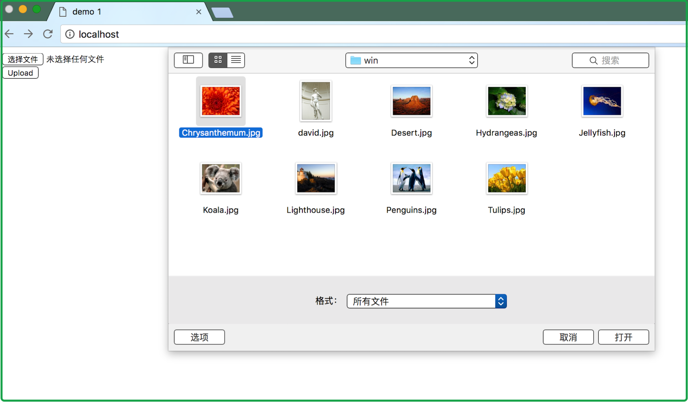

在点击 Upload 按钮之前，对网络进行限速，方便观察数据传输的过程。打开debugger

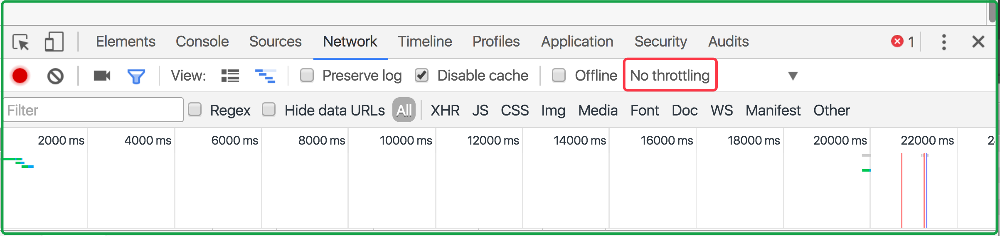

点击后，选取一个较慢的

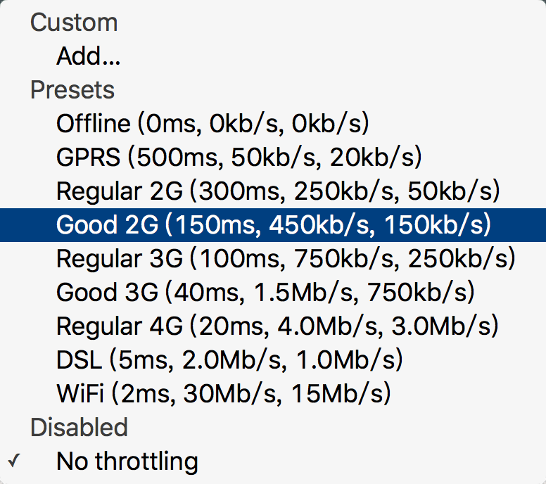

服务端会打印下面的提示，注意红框中的token，它用来表示二进制数据的边界。
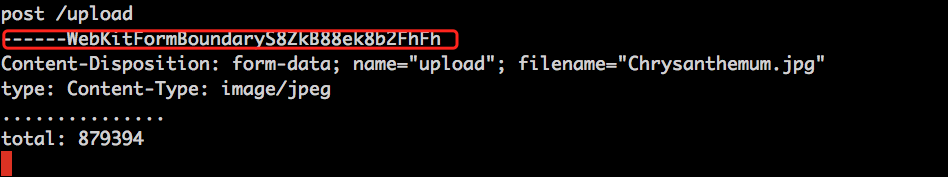

你在server.js中可以看到解析http数据的formidable函数。
你可以调试它，用来学习http协议。

上传完成后

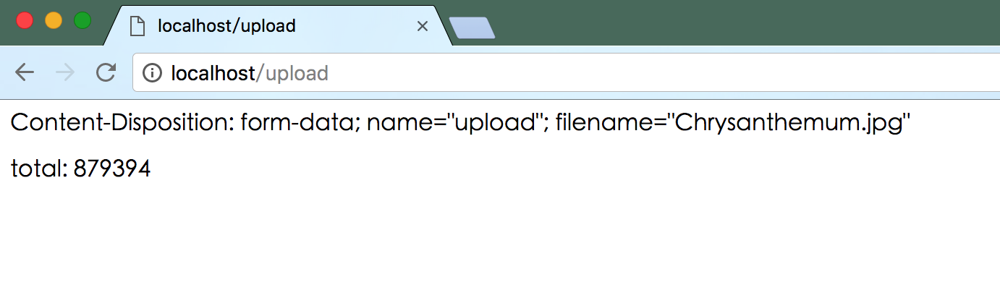

__TIP__: 观察，它是我们本次学习之旅的主要方法。你一定要运行每个例子，亲眼看到它们的结果。
它们发生了、产生了结果，你眼见为实、反复的确认后，就熟悉了这个技术。

## 2、plupload的原理
`plupload`是一个文件上传的前端插件。

[它的主页](http://www.plupload.com) [它的github地址](https://github.com/moxiecode/plupload)

demo2并没有使用`plupload`，事实上它是自己实现了`plupload`，它本身就相当于`plupload`的v0.01版本。

通过v0.01，这20行代码来一窥`plupload`的原理。而不是去读`plupload`的上万行代码，
真是有种两岸猿声啼不住，轻舟已过万重山的感觉呀。

`plupload`的原理，就是拿到文件句柄后，自己发送(XMLHttpRequest)文件。
尽量控制整个过程，从中加入自己实现的功能，这就是它的想法。

* 比如，图片预览，是在拿到文件以后在新的canvas上画出新的尺寸。
* 比如，断点续传，是在拿到文件以后slice文件，从断点处开始读取。

这些操作，都有个前提，就是要拿到文件。否则，一切就无从谈起。

## 3、moxie文件选取和文件预览

这个例子没有服务端，请直接用浏览器打开 `demo3/index.html`。然后选取图片，就可以看到预览。
这样避免你想当然的认为，预览是服务端辅助的。

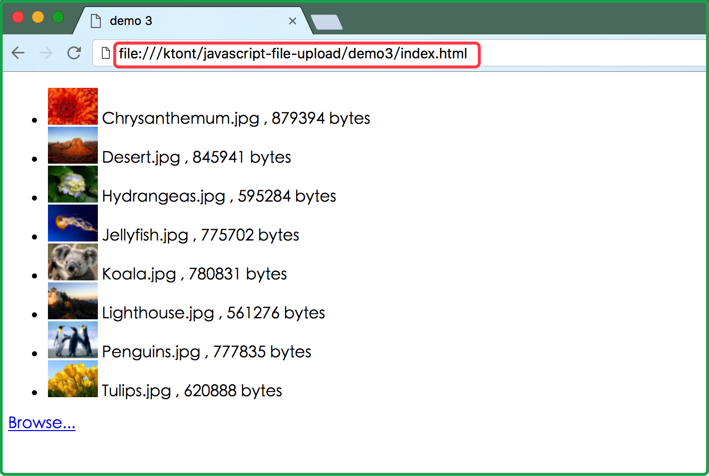

文件预览一般的做法是，先上传图片，然后从图片服务器上下载thumbnail，这么做是有缺点的，预览要先上传才能看到（可能人们更喜欢先看到再决定要不要上传）。但是这里采用的做法不同，它在本地进行预览，但这势必会增加一些cpu的开销，因为预览的实质是进行了图片压缩，要么服务端压缩要么客户端压缩而已。

实际生产中，采用哪一种做法，要看需求，或者看你方便的程度。如果需求中删除图片的概率较高，那就采用本地预览－也就是本例的做法。如果服务器能存储压缩后的thumbnail，且压力不大，速度够快，那就用服务端预览。

另外，
当你看到moxie的时候，可能会觉得莫名其妙。是这样的

打开 http://www.plupload.com/docs/

文档的最后一段话如下
* Low-level pollyfills (mOxie) - have their own code base and documentation on GitHub.
* Plupload API
* UI Widget
* Queue Widget

其实我写本文的初衷，是为了解释这四句话。
我跟你一样，一开始读不懂。

这四句话的意思是
`plupload`有四个安装等级 － 初级，中级，高级，长级

* 初级，叫moxie.min.js，插件大小77k到106k不等（神马鬼？为什么不等的原因参见 [编译moxie](docs/compile.md) 一节）。
    其中提到的pollyfills应为**polyfiles**，是帮助老浏览器跟上h5步伐的插件，叫“h5垫片”，用js提升老浏览器的api，抹平浏览器间的差异。所以moxie其实是个通用前端库。
* 中级，plupload.full.min.js，插件大小123k
      打开它看一下，发现它其实是moxie.min.js和一个叫plupload.min.js的文件合并到一起而已。
      所以`plupload`其实是在moxie的基础上，封装了一下文件上传api，专业文件上传前端库。
* 高级，它依赖
      jquery       137k
      jquery ui    282k
      plupload     123k
      plupload ui  30k
      一共约600k的大小。帮助你实现ui，叫widget － 小组件。
* 长级，它和高级差不多，也是实现一套ui。区别是ui是队列，前者的ui是块和列表。

那么回过头，再来看这个例子。这个例子只是演示文件选择，它没有上传的功能。
只有文件选择功能的`mOxie`插件的大小为77k，比正常功能要小30%。为什么呢？

因为`mOxie`是一个可以自定义的前端库，如果有些功能不需要，比如silverlight，那么就可以不把它们编到目标中。 参见[编译moxie](docs/compile.md)

那么`mOxie`都做了什么呢，为甚么有77k这么大（大吗？）的体积。它提供文件预览功能、图片压缩功能、国际化支持（就是i18n）等。同时，上面也提到，它解决浏览器的兼容性问题。

## 4、moxie文件上传，进度提示

这个例子只使用`mOxie`提供的功能，实现了**文件上传**。

~~~
13:36:02 1$ ll demo[3-4]/moxie.min.js
-rw-r--r-- ktont  staff  73499  13:53 demo3/moxie.min.js
-rw-r--r-- ktont  staff  77782  13:58 demo4/moxie.min.js
~~~
您会发现，本例中的`mOxie`库比上一例多了4k，那是因为在编译的时候加入了XMLHttpRequest的支持。
所以demo4中的moxie.min.js就是`plupload`库能投入生产的最精简版本。参见[编译moxie](docs/compile.md)

您可以在这个demo的基础上实现自己的文件上传。相比`Plupload API`，它更灵活，您可能更喜欢在这个**层次**上编写应用。当然，灵活性的对立面是复杂度，它们之间的平衡点因人而异。

## 5、使用plupload实现了图片上传

这个例子，比较实际一点，使用`Plupload API`。`Plupload API`主要在`mOxie`上实现一套事件驱动的机制。

同时，顺带演习上传的暂停和重传。为甚么在这里演习暂停和重传呢？

为了区分下个例子 -- 断点续传。断点续传是指，**重启了电脑后断点续传**。

断点续传在上传大文件的场景下，很有用。
比如我上传一个电影，中间关闭了电脑，然后睡个觉。醒来后可以继续传。

下一个例子演示断点续传。

而本例的重传是说，不重启浏览器的前提下，重新传文件。它会从头再来，之前传的会丢弃。
实际场景中，用来重传图片这种小文件。
因为小文件一个封包或几个封包就发送完了，没必要断点续传，也没法儿“断”了。
大炮不适合打蚊子，因为蚊子小（我怎么这么啰嗦——）

## 6、断点续传  

是时候请出你的硬盘女神啦！运行本程序需要一个大文件，而电影文件再合适不过了。

这次服务器的启动时，需要一个“百分比”的参数
~~~bash
$ sudo node server.js 50%
如果同时你还要指定端口号，那么
$ node server.js 3000 50%
~~~

你可能会误认为服务器会从50%的地方把数据存起来，不是的，
它的意思是告诉客户端，“请从50%的地方把剩下的文件数据发送过来“。

客户端在发送数据前，询问服务器，上次传送的百分比。然后从这个百分比处发送剩下的数据。

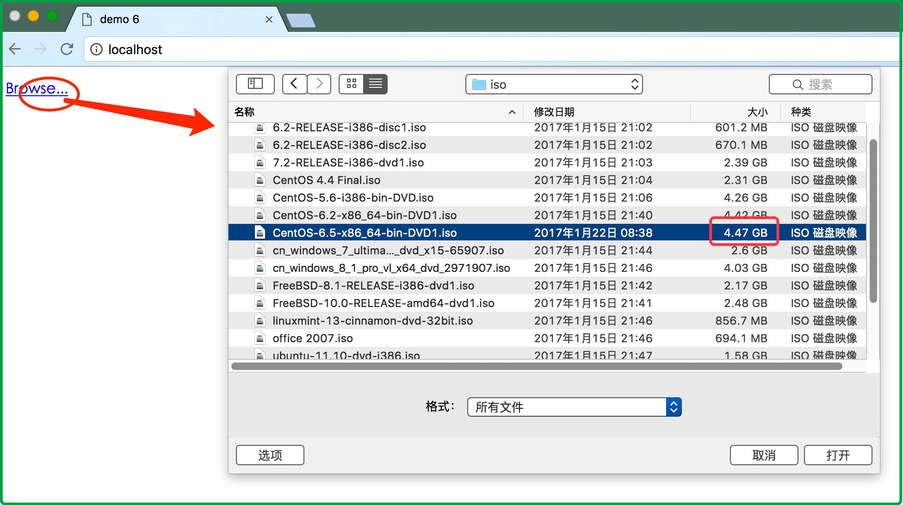

选取后，文件就开始上传

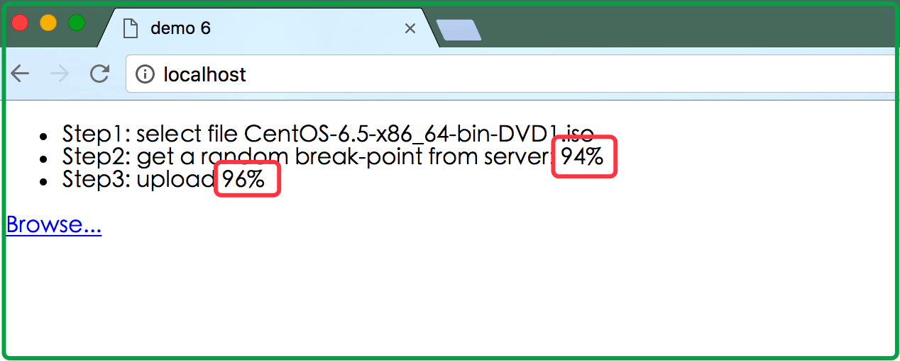

服务端的情况

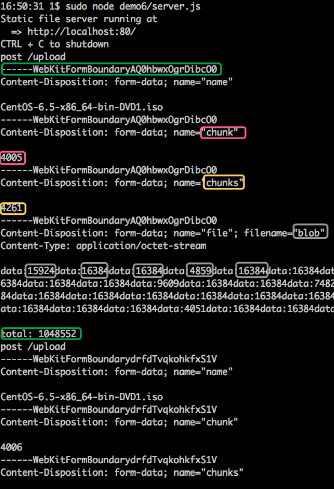

本例中使用的**块**大小是1兆字节，这个配置在`index.html`的19行
>              chunk_size: '1mb'

上图中，两个绿色框之间是一次独立的**http交互过程**，它用来发送一个**块**。
本例中的文件一共4G多，会切成4千多个块。产生4千多次http交互来发送它们。
相比不分块而一次http发送完所有数据，这么做会有些网络性能损耗。但是不分块的缺点是非常明显的。

如果真的不分块单http发送所有数据。假设网络异常，服务端hanging，客户端此时开启另一个链接retry。首先询问服务端偏移，然后从该偏移处继续发送。此时，服务端就会面临一个尴尬的选择，必须关闭之前hanging的链接，它可能已经hang up，也可能没有（取决于服务端的超时时间）。服务端一般“请求间是隔离的”，做不到这一点。最后，网络中残留的数据可能继续写入文件，导致数据错乱。

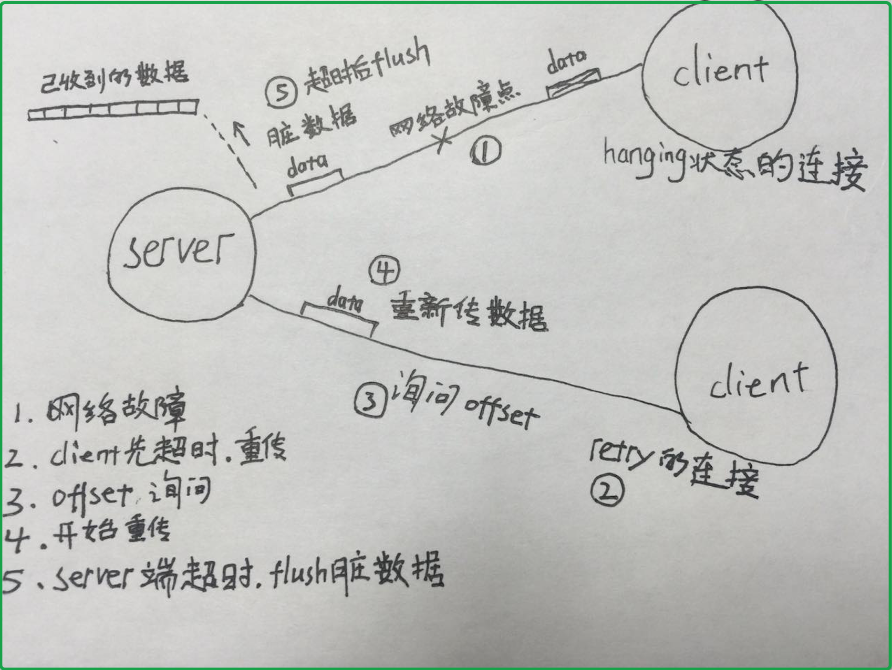

虽然，实际上不会出现上面的情况，但是理论上它是不严谨的。并且，
http协议是一个应用层协议。http协议在**application**和**network transfer**更靠近**application**。大多数http服务器都会帮你做封包的拼解工作，而让你从网络层传输层解放出来。如果达不到这一点，http的处理还是和tcp的一样麻烦，那http就不应该存在。[参考http协议](https://www.w3.org/Protocols/rfc2616/rfc2616-sec1.html)

然而，如果分块来传输，就不会遇到这个问题。如果链接hang up。那么整个请求的数据统统丢弃，偏移仍然在当前**块**。

话说回来，所以要把文件数据拆分成一个较小的单元来用http传输，并且
* 用块发送可以降低token冲突的概率。上传文件是使用一个随机token来标记数据边界(第一个绿框)的。
这个方法有缺点，可能会冲突，特别是文件大的时候。
* 适当的**块**大小，有助于浏览器读取文件。比如本例中chrome用的是slice读取文件，我们不能指望它很智能，塞给它一个很大的文件，让它很好的处理。有些浏览器对文件大小有限制，甚至在传大文件的时候会卡死。

上图中，红色的框表示当前传输的是**第几块**数据。因为我们指定是50%的百分比，所以这里是4千多的中间位置 -- 2千多。

黄色的框表示一共有多少块数据。当红色和黄色相等的时候，表示文件传输完成。

灰色的框表示传输的二进制数据，数据的边界由第一个绿框定义。这个时候，这次http交互就完成了，链接会被关闭。紧接着会是下一块数据，一个全新的http交互，token也会是一个新的。

断点续传的关键在于 －－**从文件的指定偏移处读取** (__ZHUANGBI__: c语言中fseek)

但是浏览器提供给前端的功能都是受限的，没有`fseek`，而是提供了一个`slice`功能。
比如，`slice(off, off+1024)`用来读取off处的1024字节数据。
还能凑合着用吧，那我们每次读一块数据，然后发送，再读下一块，再发送。。。

突然发现，这不就是失传已久的**socket编程**吗？搞一个**缓冲**，撸一串数据然后发出去，再撸一串数据再发出去。

好吧！幸亏不是让我们写这种恶心的数据解析工作，`plupload`已经给我们写好了，我刚撸起的袖管赶紧放了下去。

## 7、plupload ui widget的示例

这个例子，用来展示plupload的`UI Widget`。

除非你看到它，否则我怎么描述都没用。

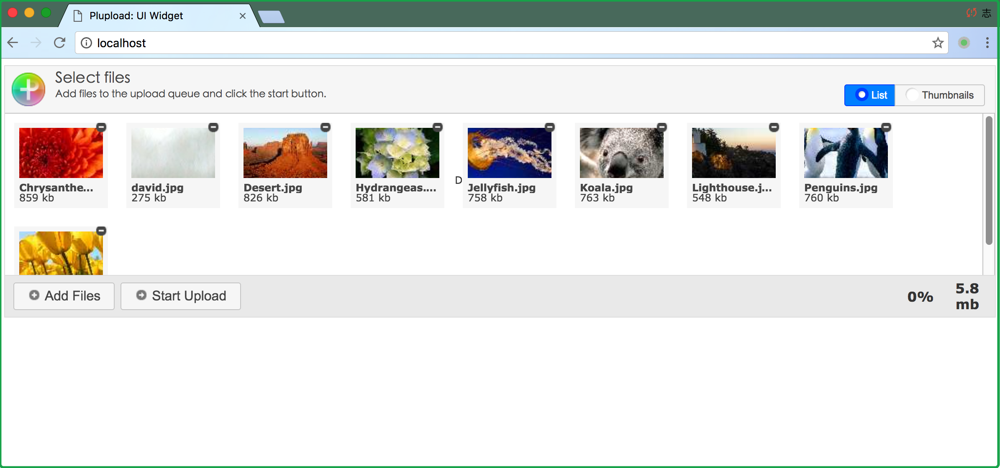

如果你看到它了，没错！就是它！
